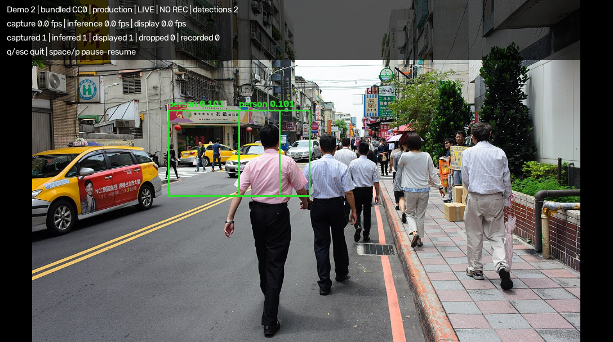
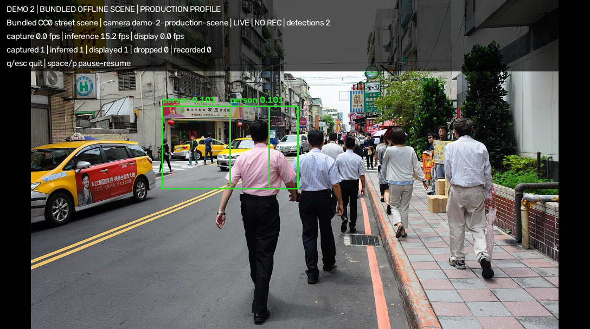

# VerkEye

Public project: [github.com/GainSec/VerkEye](https://github.com/GainSec/VerkEye)

This repository is Part 8 of the Verkracked Security Research Project by
[Jon “GainSec” Gaines](https://gainsec.com).

## Related Verkracked releases

| Part | Project | Links |
| --- | --- | --- |
| Part 0 | Introduction to the Verkracked research project | [GainSec article](https://gainsec.com/2026/09/06/verkracked-security-research-on-verkada-anti-crime-devices-part-0/) |
| Part 4 | Alarm-hub local cloud framework | [GitHub](https://github.com/GainSec/verkada-verkracked-alarm-hub-local-framework) · [Parts 4 & 5 article](https://gainsec.com/2026/09/06/verkracked-parts-4-5-local-cloud-and-sub-ghz-frameworks-for-verkada-alarm-hubs/) |
| Part 5 | Alarm-hub Sub-GHz interoperability framework | [GitHub](https://github.com/GainSec/verkada-verkracked-subghz-framework) · [Parts 4 & 5 article](https://gainsec.com/2026/09/06/verkracked-parts-4-5-local-cloud-and-sub-ghz-frameworks-for-verkada-alarm-hubs/) |
| Part 7B | CB62 local cloud emulator | [GitHub](https://github.com/GainSec/verkada-verkracked-bullet-cam-cloud-emulator) |
| Part 8 | VerkEye CB62 model runtime | [GitHub](https://github.com/GainSec/VerkEye) · [GainSec article](https://gainsec.com/2026/10/04/verkracked-part-8-verkeye/) |
| Part 10 | CB62 firmware dumper | [GitHub](https://github.com/GainSec/verkada-verkracked-ambrella-CB62-firmwaredumper) |

Parts without linked public material remain subject to their disclosure and
publication schedules.

VerkEye is an evidence-first research tool for inspecting and reconstructing
Ambarella CV22 model packages recovered from Verkada cameras. The current proof
of concept targets the exact CB62 `yolov6n_hor.bin` artifact:

- Size: `5,561,124` bytes
- SHA-256: `eb768eb6691c08a5648424bb3fbc4a5ee09a64584e7faa3236afa778f5f5eabf`

The parser recovers the container, boundary tensor descriptors, split
connections, opaque compiled regions, and a provenance-preserving intermediate
representation. Direct ONNX transpilation remains fail-closed, but the exact
recovered model now executes camera-free through a recovered-operator
compatibility runtime accelerated by MLX on Apple silicon and OpenVINO on
Linux. Ambarella ADES remains the independent oracle. The registered
**29-case** corpus covers synthetic constants and boundaries, seeded random
input, structured patterns, generated media, **18 public traffic-camera
images**, and decoded-video frames. Both accelerated backends match all **174
terminal tensors** with **zero differing bytes**, including the natural image
that originally exposed score-head drift. VerkEye does not substitute weights,
retrain the model, or invent graph operators.

## Quick start

The public repository contains the independently authored runtime generator,
parsers, accelerated execution code, and validation methodology. Generated
runtime parameters are not distributed. This repository intentionally excludes
recovered camera artifacts: the horizontal and vertical models, generated
runtime contents, CV22 vendor executables, libraries, kernel modules, firmware,
bytecode, and production configuration. The horizontal model remains an
owner-supplied input and is never embedded in public packages.

On Apple silicon, clone or unpack the repository, then supply the exact model
from a CB62 you own before installing VerkEye:

```bash
# From the extracted or cloned VerkEye repository:
cd VerkEye

# Extract yolov6n_hor.bin from a CB62 you own, then copy it here.
cp /path/to/owner-extracted/yolov6n_hor.bin fixtures/models/yolov6n_hor.bin
printf '%s  %s\n' \
  eb768eb6691c08a5648424bb3fbc4a5ee09a64584e7faa3236afa778f5f5eabf \
  fixtures/models/yolov6n_hor.bin | shasum -a 256 -c -

python3 -m venv .venv
source .venv/bin/activate
python -m pip install -U pip
python -m pip install -e '.[dev,viewer,macos]'

# Docker Desktop (or another Docker-compatible runtime) must be running.
verkeye generate-runtime fixtures/models/yolov6n_hor.bin

export VERKEYE_MODEL="$PWD/fixtures/models/yolov6n_hor.bin"
verkeye --demo 2
```

Use `verkeye --demo 1` for the refreshed Singapore traffic-camera demo, or
`verkeye live fixtures/models/yolov6n_hor.bin --webcam 0 --backend accelerated`
for a local webcam. Linux uses the `linux` extra in place of `macos`; the tested
Intel UHD 630 OpenVINO host is exact but slower than the Apple-silicon path.

The generation step invokes a digest-pinned linux/amd64 Ambarella ADES image,
captures the parameters produced from the owner's model, converts them to an
address-free local format, verifies the complete result, and stores it beneath
the Git-ignored `.runtime/generated/` directory. Neither the owner model nor
the generated runtime is added to the repository.

The public `evidence/` directory is deliberately compact. It contains the
runtime pipeline contract, the published demo images and records, and the
machine-readable parity and performance summaries needed to audit the release.
The much larger raw forensic/development corpus is intentionally excluded; it
is not required to install or run VerkEye. See [`evidence/README.md`](evidence/README.md)
for the exact boundary.

An owner-supplied recovered vertical build can also be used as a hash-pinned
comparison oracle. A
byte-exact package differential identifies 3,516,714 invariant compiled bytes
across six one-to-one split pairs. This narrows the unknown surface without
claiming that invariant bytes are specifically weights, instructions,
constants, or relocations:

```bash
PYTHONPATH=src .venv/bin/python scripts/analyze_model_variants.py \
  fixtures/models/yolov6n_hor.bin \
  fixtures/models/yolov6n_ver.bin \
  --out evidence/yolov6n-hor-ver-differential.json
```

## Current result

| Capability | Status | Evidence boundary |
|---|---|---|
| CV22 container map | Passed | Ten split records and complete top-level byte accounting |
| Boundary tensor map | Passed | 39 descriptors, one external input, 16 split edges, six terminal outputs; exact memory/storage-format ABI |
| VerkEye IR v1 | Passed | Ten opaque nodes and regions; every object retains source-byte provenance |
| Media/preprocessing/post-processing | Passed | Exact 1088×608 planar-BGR contract and binary-proved detector core |
| Weight extraction | Blocked | No evidenced parameter directory or instruction/constant boundary |
| Quantization recovery | Partial / blocked | Storage width, signedness, exponent offsets/bits recovered for all 39 tensors; value formula, zero points, parameters, and verified layer remain unresolved |
| Exact ONNX export | Blocked | Would require invented model semantics |
| Exact-artifact local inference | Passed accelerated + ADES oracle | MLX and OpenVINO execute the recovered operator graph; every one of the 174 terminal tensors across the 29-case registered corpus is byte-identical to ADES, with zero differing bytes, prediction mismatches, or production detection mismatches |
| Image and file-video | Passed | Exact accelerated image/video execution and historical ADES runs preserve the recovered detector contract |
| Frame-directory and webcam | Passed / interactive | The continuous viewer uses the same exact per-frame core, a bounded drop-oldest webcam queue, measured counters, and clean interactive controls |
| Accelerated throughput | Mac target passed; tested Kali target open | MLX: **32.236698 FPS** on Apple silicon. OpenVINO GPU: **3.051105 FPS** on Intel UHD 630 with correctness gated before and after each benchmark |
| Current public-camera sanity check | Small-object recognition confirmed | 18 current government traffic stills completed at 31–33 FPS. Production accepted 0; the local small-object profile accepted one visually correct person box on a motorcycle rider without changing model bytes or class thresholds |
| Physical CV22 parity | Pending | Independent camera fixture; not required for camera-free operation |

The current MLX path executes the exact recovered artifact in real time on the
tested Mac. The OpenVINO path executes the same recovered graph, but the tested
Kali UHD 630 does not meet the 15 FPS Linux target. Both reject model, tensor,
and geometry drift. Direct ONNX conversion
remains blocked because it would require a misleading generic graph export;
that limitation does not prevent exact compatibility execution.

## Exact accelerated runtime

The accelerated runtime reconstructs the recovered CB62 computation directly:

```text
exact recovered model -> 55 recovered fastconv/mixed operators
                      -> MLX or OpenVINO
                      -> six exact detector heads
                      -> recovered 13,566 x 8 detector core
```

Correctness is not inferred from visual similarity or decoded detections. The
strict parity gate compares the six raw float32 terminal tensors byte-for-byte,
then compares the assembled **13,566 × 8** float32 prediction matrix and the
production postprocessor result. The deterministic **29-case** corpus contains
three constants, two boundary-value inputs, one seeded-random input, two
structured patterns, one generated image, 18 current public traffic-camera
images, and two decoded-video frames. MLX and OpenVINO both pass all **174
terminal tensors** with **zero differing bytes**, zero prediction mismatches,
and zero production detection mismatches.

That corpus exposed and closed four portability-sensitive CV22 semantics:
dynamic SPPF max pooling, signed 2×2 transpose-fastconv accumulator saturation,
the signed fastconv pre-offset accumulator clamp, and distinct recovered
sigmoid mappings. The natural Singapore LTA camera 2704 case that previously
showed 65 score-element differences now matches ADES exactly at all six terminal
heads.

The strict production corpus produces no accepted detections at the recovered
thresholds, so a separate nonempty postprocessing contract verifies exact class
IDs, source indices, confidence and box float32 bits, ordering, filters, NMS,
NaN handling, and recovered maximum behavior. The optional `small-object`
profile still changes only minimum normalized area from `0.001` to `0.00025`;
it is explicitly not the production-equivalent comparison profile.

The current model-boundary benchmark measured **32.236698 FPS** on MLX over 100
frames after 10 warmups (p50 31.039375 ms, p95 31.345125 ms). OpenVINO GPU on
the tested Kali Intel UHD Graphics 630 measured **3.051105 FPS** (p50 330.735334
ms, p95 336.715689 ms). Both benchmarks run the exact preprocessing, recovered
model, prediction assembly, and production postprocessor, with exactness checked
immediately before and after timing. The Kali result is suitable for exact
offline execution but remains below the 15 FPS live-video target.

## Exact camera-free ADES runtime

The runtime pins the exact model, a linux/amd64 Ambarella image by digest,
Cavalry 2.1.7 (`c5db5f1`), the exact detector pipeline evidence, and all ten
generated DVI hashes in `config/cb62-ades-runtime.json`. On every inference it
executes all ten recovered split programs, preserves 22 tensor artifacts,
assembles the exact 13,566×8 float32 prediction matrix, and applies only the
binary-proved detector core.

Two clean Kali zero-input runs and one macOS run produced identical hashes for
all 22 tensors. A real 1088×608 image completed in 35.827 seconds. The same
decoded frame wrapped in a lossless FFV1 video completed in 35.220 seconds at
0.0283929585 effective FPS; its decoded BGR hash and prediction hash were
identical to the still-image route. The reproducibility record is
`evidence/compatibility/cb62-ades-media-smoke-20261002.json`.

## Camera-free compatibility progress

The fallback path now executes the recovered AArch64 NNCtrl library under
QEMU user mode. Against the pinned model it deterministically:

1. resolves the recovered NNCtrl ABI;
2. parses all ten compiled DAG packages;
3. requests and loads a 31,726,784-byte working arena;
4. preserves the loaded-arena fingerprint `920cfc89e947bcb0`; and
5. reaches the real `CAVALRY_RUN_DAGS` request (`0xc0084303`).

An AArch64 preload shim emulates only the evidenced 12,288,000 Hz audio-clock
query. It captures the exact RUN_DAGS request and then returns `ENOTSUP`.
Therefore this milestone proves camera-free model parsing, loading, and ABI
reachability—not inference. The 64 KiB request capture contains a 60-byte
header followed by ten fixed 2,860-byte descriptors. The exact pinned NNCtrl
0.3.0 assignment source names the descriptor control bits, DVI addresses and
sizes, port records, and poke records. Four prefix words at `+0x14` through
`+0x20` remain explicitly unknown and are preserved raw.

The follow-up capture preserves the complete 31,726,784-byte post-load arena.
It proves that `dvi_dram_addr` at `+0x04` identifies each package's physical
address and `dvi_img_size` at `+0x0c` identifies its exact byte length: all ten
selected arena slices are byte-identical to the ten recovered compiled
packages, for 5,514,624 verified bytes. The descriptor tables identify 23
unique bounded regions totaling 14,319,648 bytes. Package alignment, those
regions, and one 32-byte gap end at byte 19,834,560, exactly matching NNCtrl's
reported `total_dag_bytes`; the remaining 11,892,224 working bytes are retained
as unassigned rather than given guessed semantics.

Raw stdout, QEMU syscall traces, ioctl JSONL, request bytes, the full arena,
deterministic analysis, hashes, and the exact invocations are preserved in
`evidence/compatibility/ioctl-shim-run-002/` and
`evidence/compatibility/ioctl-shim-run-003/`. Reproduce the capture analysis
with:

```bash
.venv/bin/python scripts/analyze_cavalry_capture.py \
  --model fixtures/models/yolov6n_hor.bin \
  --driver fixtures/vendor/cv22/cavalry.ko \
  --snapshot evidence/compatibility/ioctl-shim-run-003/run-dags-000000.bin \
  --arena evidence/compatibility/ioctl-shim-run-003/working-memory.bin \
  --probe-stdout evidence/compatibility/ioctl-shim-run-003/stdout.txt \
  --ioctl-trace evidence/compatibility/ioctl-shim-run-003/ioctl.jsonl \
  --physical-base 0x10000000 \
  --json-out evidence/compatibility/ioctl-shim-run-003/capture-analysis.json
```

The command verifies the semantic assignment source at
`third_party/ambarella/nnctrl-0.3.0/src/rundags.c` against SHA-256
`b6b4197498d81a8c5dfa393a0516ebb179c9be889e72d58245c7038ca74bca6e`.
The resulting capture report hashes to
`18e22466b1a56842c4321e62141022151faf04724d3313a7480a7aa43182c927`.

The shim and native ABI probe are in `src/verkeye/compat/native/`.

### Reproduce the public Cavalry ABI correlation

A contemporary public Ambarella virtualization tree now supplies
`cavalry_ioctl.h` and `cavalry_gen.h`. The headers are pinned at commit
`71b1b786689f690248524b5139838b0a778047c7` and verified by SHA-256 before
analysis. They define the 64-bit pointer-sized Linux ioctl ABI, identify CV22
as generator architecture `0x1`, and use generator format version `3.0.4`.

The correlation is strong but deliberately bounded: 35 of the 38 request
numbers dispatched by the recovered CB62 driver also exist in the public
header. All 17 requests independently observed at recovered userspace
callsites match numerically; 15 retain the same macro name, while the two
hotlink-slot operations have name drift. Three recovered requests are absent
from the contemporary header. The public headers first appeared in September
2026, and their structures have evolved, so VerkEye does not import their
offsets or sizes as the historical CB62 layout and does not treat them as DVP
instruction semantics.

```bash
git clone --filter=blob:none https://github.com/cchiou-amba/amba-virt \
  /tmp/verkeye-amba-virt
git -C /tmp/verkeye-amba-virt checkout \
  71b1b786689f690248524b5139838b0a778047c7

.venv/bin/python scripts/analyze_public_cavalry_abi.py \
  --ioctl-header /tmp/verkeye-amba-virt/guest-os/linux/amba-cavalry/include/cavalry_ioctl.h \
  --gen-header /tmp/verkeye-amba-virt/guest-os/linux/amba-cavalry/include/cavalry_gen.h \
  --driver-report evidence/compatibility/cavalry-driver-abi.json \
  --out evidence/compatibility/public-cavalry-abi.json

.venv/bin/python scripts/analyze_vendor_sources.py \
  --nnctrl-source third_party/ambarella/nnctrl-0.3.0 \
  --cavalry-mem-source third_party/ambarella/cavalry_mem-0.0.6 \
  --nnctrl-binary fixtures/vendor/cv22/libnnctrl.so.0.3.0 \
  --cavalry-mem-binary fixtures/vendor/cv22/libcavalry_mem.so.0.0.6 \
  --public-abi-report evidence/compatibility/public-cavalry-abi.json \
  --out evidence/compatibility/vendor-source.json
```

The build gate remains blocked specifically on the exact CB62-era SDK
headers, byte-identical descriptor layouts, and hidden CV22 DVP semantics. It
is no longer accurate to say that no public Cavalry headers exist.

## Recovered tensor descriptor ABI

The exact `nnctrl` 0.3.0 source snapshot and the pinned production
`libnnctrl.so.0.3.0` now jointly prove the formerly anonymous tensor fields.
The source assigns `io_descriptor_t` members into the public `io_dim` and
`io_data_fmt` structures; the matching AArch64 function at virtual address
`0x8398` fixes their serialized offsets and packed bit slices:

| Offset | Proven field |
|---:|---|
| `+0x10` | pitch |
| `+0x14` | pitch patch byte offset |
| `+0x18[5:0]` | pitch patch bit width |
| `+0x18[9:6]` | DRAM format |
| `+0x18[10]` | bitvector flag |
| `+0x74` | signedness |
| `+0x75` | element-size code (`0..3` → `8..64` storage bits) |
| `+0x76` | signed exponent offset / documented Q value |
| `+0x77` | exponent-bit count |
| `+0x78` | buffer extent |

All 39 records now expose exact storage dtypes and exponent fields. VerkEye
does not turn those fields into scales, zero points, or IEEE floating-point
values because the recovered evidence has not yet established those formulas.
The deterministic proof is generated with:

```bash
.venv/bin/python scripts/analyze_descriptor_abi.py \
  --library fixtures/vendor/cv22/libnnctrl.so.0.3.0 \
  --source third_party/ambarella/nnctrl-0.3.0 \
  --out evidence/compatibility/descriptor-abi.json
```

## Installation

Python 3.11 or newer is required.

Clone or unpack the public repository and create an isolated environment:

```bash
# From the extracted or cloned VerkEye repository:
cd VerkEye
python3 -m venv .venv
source .venv/bin/activate
python -m pip install -U pip
```

Install the runtime for the host platform. Use the `viewer` extra when a native
webcam/video window is wanted; use `runtime` for headless file processing:

```bash
# Apple silicon / MLX, headless
python -m pip install -e '.[dev,runtime,macos]'

# Apple silicon / MLX with the native live viewer
python -m pip install -e '.[dev,viewer,macos]'

# Linux / OpenVINO, headless
python -m pip install -e '.[dev,runtime,linux]'

# Linux / OpenVINO with the native live viewer
python -m pip install -e '.[dev,viewer,linux]'
```

Extract `yolov6n_hor.bin` from a CB62 you own, place it at
`fixtures/models/yolov6n_hor.bin`, and verify it before first use:

```bash
printf '%s  %s\n' \
  eb768eb6691c08a5648424bb3fbc4a5ee09a64584e7faa3236afa778f5f5eabf \
  fixtures/models/yolov6n_hor.bin | shasum -a 256 -c -
```

### Generate the owner-local runtime

Generated runtime parameters are not distributed. Build them from the exact
model extracted from your own CB62:

```bash
# Requires Docker/Podman capable of running the pinned linux/amd64 image.
verkeye generate-runtime fixtures/models/yolov6n_hor.bin
```

The command fails closed unless the model hash matches the supported CB62
horizontal package. It prepares the pinned ADES toolchain, captures all 55
fast-convolution parameter sets and the two required static masks, removes
process-local addresses, verifies every member, and atomically installs:

```text
.runtime/generated/<model-sha256>/
├── manifest.json
├── fastconv/call-000.vkfc ... call-054.vkfc
└── masks/split4.bin, split5.bin
```

Every member's size and SHA-256 is recorded in the local manifest. `run` and
`live` discover this content-addressed runtime automatically. The entire
`.runtime/` tree is ignored by Git. See
[`docs/OWNER_RUNTIME_GENERATION.md`](docs/OWNER_RUNTIME_GENERATION.md) for
requirements, alternate container commands, diagnostics, and cleanup.

The larger 29-case ADES oracle corpus is needed only for full parity
verification. Ordinary image, video, webcam, and demo inference does not read
it. Session construction fails closed if any local package or mask is missing,
malformed, or inconsistent.

```bash
# Apple silicon
.venv/bin/python scripts/verify_accelerated_equivalence.py \
  --backend mlx \
  --json-out evidence/equivalence/macos-mlx-terminal-parity.json

# Linux with OpenVINO GPU; use CPU when GPU is unavailable
.venv/bin/python scripts/verify_accelerated_equivalence.py \
  --backend openvino --openvino-device GPU \
  --json-out evidence/equivalence/kali-openvino-terminal-parity.json
```

Expected summary:

```text
cases=29 terminal_tensors=174 differing_bytes=0 detection_mismatches=0 status=passed
```

Run exact accelerated inference:

```bash
verkeye run fixtures/models/yolov6n_hor.bin \
  --image FRAME.png --backend accelerated \
  --json-out RESULT.json --manifest-out RESULT.manifest.json

verkeye run fixtures/models/yolov6n_hor.bin \
  --video CLIP.mp4 --max-frames 300 --backend accelerated \
  --accelerated-device GPU \
  --json-out VIDEO.json --manifest-out VIDEO.manifest.json
```

To relocate owner-generated runtime material, select its parent directory:

```text
--generated-runtime-base /absolute/path/to/generated
```

The legacy `--accelerated-capture-root`, `--accelerated-split4-root`, and
`--accelerated-split5-root` flags remain available only for researchers
migrating older private workspaces.

### Owner-supplied model boundary

This repository intentionally excludes recovered camera artifacts and all
generated runtime contents. Extract `yolov6n_hor.bin` from a CB62 you own and
place it at that path. Exact execution fails closed unless the file is
5,561,124 bytes and has SHA-256
`eb768eb6691c08a5648424bb3fbc4a5ee09a64584e7faa3236afa778f5f5eabf`.

`run` defaults to the binary-proved `production` postprocessor profile. For
small or distant objects, opt into the local sensitivity profile explicitly:

```bash
verkeye run fixtures/models/yolov6n_hor.bin \
  --image FRAME.png --backend accelerated \
  --detection-profile small-object \
  --json-out RESULT.json --manifest-out RESULT.manifest.json
```

The `small-object` profile executes the identical recovered model and preserves
the recovered class thresholds, box decode, aspect-ratio and border filters,
NMS, and maximum detection count. It changes only the host-side minimum
normalized box area from `0.001` to `0.00025`. Every result records the selected
profile and the changed field. The production profile remains the default for
forensic `run` commands.

The `runtime` extra installs NumPy and headless OpenCV for local media adapters,
preprocessing, detector post-processing, and overlays. The accelerated backend
shown above runs locally through MLX or OpenVINO and does not require Docker.
Only the independent `--backend ades` oracle requires a Docker-compatible
runtime capable of running its pinned linux/amd64 image. Its first run prepares
and verifies the ADES workspace automatically; `--prepare` forces regeneration.
Built wheels carry the runtime specification, pipeline evidence, native
executor, and capture-hook sources under `share/verkeye/ades`; they do not
carry a recovered model or generated parameters.

## Live viewer

`verkeye live` opens a BirdEye-style local display for a selected webcam or a
video file. It executes the **exact recovered CB62 model** through the same
verified accelerated runtime used by `verkeye run`; there is no proxy model,
replacement detector, or visual-only inference path. The display frame is the
actual deterministic model input: arbitrary decoded BGR frames are converted by
a centered-letterbox policy to **1088 × 608**, then that exact byte array is
passed to inference and annotated.

### One-command demonstrations

After installing the `viewer` and platform extras, either fixed demonstration
uses the owner-generated runtime and starts from the top-level command. Set
`VERKEYE_MODEL` to the owner model first; no source path or operating-profile
argument is needed:

```bash
# Current Singapore LTA traffic stills, refreshed every 60 seconds.
# Uses the explicit local small-object profile for distant road scenes.
verkeye --demo 1

# Bundled offline CC0 street scene. No user media or network is required.
# Uses the binary-proved production postprocessor profile unchanged.
verkeye --demo 2
```

Both demonstrations execute the exact recovered model whose SHA-256 is
`eb768eb6691c08a5648424bb3fbc4a5ee09a64584e7faa3236afa778f5f5eabf`,
through the same accelerated backend and native viewer as `verkeye live`.
Demo 1 identifies the current Singapore camera in the HUD. Demo 2 loops a
365,478-byte CC0 fixture whose SHA-256 is
`459f3696a29606084bbb18e3e2acb2f435f72c31f74f5637c480db0267109741`;
the pinned production acceptance record contains two visible `person 0.101`
detections. Press **Space / P** to pause or resume and **Q / Esc** to quit.

#### Example output

| Annotated model output | Native VerkEye viewer |
|---|---|
| [](evidence/demos/demo-2-annotated.png) | [](evidence/demos/demo-2-screenshot.png) |

Green boxes are accepted production-profile detections. These committed Demo 2
outputs show two `person` matches, each at confidence `0.101`; click either
image to view the full 1088 × 608 frame. Visible objects without a box were not
accepted by the recovered production thresholds in this run.

Demo 2's fixture, provenance sidecar, acceptance record, annotated output, and
native-window session are committed under `src/verkeye/assets/demo` and
`evidence/demos`. The fixture is “Officers Walking on Jinzhou Street, Taipei in
Lunch Time 20150901” by 玄史生, dedicated under CC0 1.0. This is a deterministic
smoke demonstration, not an accuracy benchmark or a claim of physical CB62
optics/ISP parity.

Install the GUI-enabled OpenCV and MLX extras, then select a camera index:

```bash
python3 -m venv .venv
.venv/bin/pip install -e '.[dev,viewer,macos]'

.venv/bin/verkeye live fixtures/models/yolov6n_hor.bin \
  --webcam 0 --backend accelerated --queue-size 2 \
  --summary-out evidence/viewer/webcam-session.json
```

The live viewer defaults to `--detection-profile small-object`; use
`--detection-profile production` when an exact reproduction of the recovered
production area gate is required.

Run the same continuous viewer against a prerecorded file and optionally save
the annotated 1088 × 608 output:

```bash
.venv/bin/verkeye live fixtures/models/yolov6n_hor.bin \
  --video clip.mp4 --backend accelerated \
  --record evidence/viewer/clip-annotated.mp4 --record-fps 30 \
  --summary-out evidence/viewer/clip-session.json
```

Controls:

- **Space / P** — pause or resume both capture and display.
- **Q / Esc** — cleanly quit; closing the native window also exits.

The HUD renders CB62 labels `person`, `vehicle`, and `animal` with confidence
and bounding boxes. It also shows **Capture FPS**, **Inference FPS**, **Display
FPS**, captured/inferred/displayed/recorded frame counters, and dropped frames.
Webcam capture retains the bounded drop-oldest queue: if inference falls behind,
old frames are discarded so latency stays bounded instead of allowing memory or
delay to grow indefinitely. File video remains sequential and does not drop.

The final camera-free Mac smoke used a 300-frame prerecorded fixture because no
physical webcam was enumerated. It measured **31.88 FPS** inference and **30.26
FPS** capture/display: **300 captured**, 300 inferred, 300 displayed, and **zero
drops**. Reproduce it with:

```bash
.venv/bin/python scripts/smoke_live_viewer.py \
  --model fixtures/models/yolov6n_hor.bin \
  --frames 300 --backend accelerated \
  --summary-out evidence/viewer/macos-prerecorded-summary.json \
  --frame-out evidence/viewer/macos-prerecorded-frame.png
```

Evidence:

- `<repo-root>/evidence/viewer/macos-prerecorded-summary.json`
- `<repo-root>/evidence/viewer/macos-prerecorded-frame.png`
- `<repo-root>/evidence/viewer/macos-native-window-summary.json`

`verkeye live` is intentionally separate from bounded evidence collection with
`verkeye run --webcam ... --max-frames ...`: `live` is an operator-controlled
continuous UI, while `run` produces a finite forensic result and manifest. A
GUI-capable desktop session is required. If OpenCV reports that HighGUI is
unavailable, install the `viewer` extra in a clean environment rather than the
headless `runtime` OpenCV package.

## Owner-supplied forensic corpus

The expected model, Cavalry microcode, and recovered CV22 userspace artifacts
are described by hash in `config/cb62-artifacts.json`, but none of those camera
files are distributed here. Owners may extract them into the ignored fixture
paths to reproduce the forensic reconstruction tests. Each artifact is
identified by role, source, architecture, size, and SHA-256.

`verkeye.corpus.ArtifactCorpus` resolves owner-provided paths relative to the
manifest and refuses missing, modified, duplicated, or contradictory entries.
The normal image, video, demo, and live-viewer runtime does not load the vendor
executables, libraries, kernel module, firmware, bytecode, or raw camera
configuration.

The physical-device reference trace is deliberately optional and unavailable.
It may later provide a final hardware-parity oracle, but the camera-free runtime
must not depend on it.

## Exact-model fixture

Extract the fixture from a filesystem image or export from a CB62 you own. The
tool refuses it if its hash differs:

```bash
./scripts/extract_exact_model.sh
```

Example owner-controlled source locations:

```text
<owner-corpus-root>/evidence/approot/cb62-specimen2-approot-ml-corpus-20260927.tar.zst
<owner-storage>/bull-cam-2-non512/offline-approot/b/var/cache/cvproc/yolov6n_hor.bin
```

## CLI

All successful inspection commands write deterministic JSON plus a manifest
containing exact arguments, tool version, artifact paths, sizes, SHA-256 hashes,
gate states, warnings, and incomplete dispositions. Writes are atomic.

```bash
verkeye inspect fixtures/models/yolov6n_hor.bin \
  --json-out evidence/inspect.json \
  --manifest-out evidence/inspect.manifest.json

verkeye map fixtures/models/yolov6n_hor.bin \
  --json-out evidence/map.json \
  --manifest-out evidence/map.manifest.json

verkeye ir fixtures/models/yolov6n_hor.bin \
  --json-out evidence/model.ir.json \
  --manifest-out evidence/model.ir.manifest.json
```

`--manifest-out` is optional for `inspect`, `map`, and `ir`; when omitted, the
default is `<json-out>.manifest.json`.

Direct conversion commands remain fail-closed, while `run` executes the exact
recovered artifact through the pinned ADES backend:

```bash
verkeye convert fixtures/models/yolov6n_hor.bin \
  --output artifacts/model.onnx \
  --manifest-out evidence/convert.manifest.json

verkeye validate fixtures/models/yolov6n_hor.bin artifacts/model.onnx \
  --manifest-out evidence/validate.manifest.json

verkeye run fixtures/models/yolov6n_hor.bin \
  --image frame.png \
  --json-out evidence/image-result.json \
  --manifest-out evidence/image-result.manifest.json

verkeye run fixtures/models/yolov6n_hor.bin \
  --video clip.mkv --max-frames 10 \
  --json-out evidence/video-result.json \
  --manifest-out evidence/video-result.manifest.json

verkeye run fixtures/models/yolov6n_hor.bin \
  --frames ./frames --max-frames 10 \
  --json-out evidence/frames-result.json \
  --manifest-out evidence/frames-result.manifest.json

verkeye run fixtures/models/yolov6n_hor.bin \
  --webcam 0 --max-frames 10 --queue-size 2 \
  --json-out evidence/webcam-result.json \
  --manifest-out evidence/webcam-result.manifest.json
```

`convert` and `validate` exit with code 2, emit no converted model, and write a
`verkeye.execution-manifest.v1` record with the exact blockers. `run` exits
with code 1 on missing, changed, undecodable, unbounded, or otherwise invalid
input. Webcam execution is deliberately bounded: `--max-frames` is mandatory.

## Python components

- `verkeye.cv22`: bounds-checked readers, range accounting, container records,
  source/binary-proven tensor descriptor ABI, split graph, compiled-package and
  numeric gate analysis, and same-offset package differential evidence.
- `verkeye.ir` / `verkeye.ir_json`: immutable provenance-aware IR, deterministic
  serialization, strict JSON Schema validation, and round trips.
- `verkeye.runtime.sources` / `verkeye.runtime.live`: image, naturally sorted
  frame-directory, and file-video adapters plus concurrent webcam capture with
  deterministic resource cleanup, bounded drop-oldest backpressure, capture
  timestamps, and captured/yielded/dropped/discarded accounting.
- `verkeye.runtime.preprocess`: explicit stretch/letterbox profiles and inverse
  coordinate transforms. Operational fields have no silent defaults.
- `verkeye.runtime.backend`: immutable, hash-pinned graph/tensor contracts and
  raw-output/intermediate evidence records shared by execution backends.
- `verkeye.runtime.reference`: deterministic exact-integer execution for fully
  explicit graphs. It rejects the production `cv22.opaque_compiled_split`
  graph and directs it to the CV22 compatibility backend.
- `verkeye.compat.ades_runtime`: immutable ADES runtime contract, preparation,
  DVI verification, exact split execution, raw tensor preservation, and timing.
- `verkeye.runtime.inference`: one exact decoded-frame core shared by image,
  frame-directory, file-video, and webcam routes.
- `verkeye.runtime.yolov6`: a generic decoded-head YOLOv6 post-processor with
  confidence filtering and class-aware NMS, plus the separately binary-proved
  CB62 raw-head core. The generic path is never substituted for the CB62 core.
- `verkeye.runtime.overlay`: deterministic detection metadata and overlays.

## Development and verification

```bash
python3 -m pytest -q
python3 -m pytest -q tests/test_evidence.py tests/test_cli.py
python3 -m pytest -q tests/runtime
python3 -m pytest -q tests/test_workbench_docs.py
```

The clean-public verification count is recorded in the release manifest after
each release build. Owner-fixture tests skip explicitly when their recovered
inputs are absent. The final native HighGUI smoke exited cleanly after three
exact-model frames, and the final 300-frame completion run sustained 31.56
inference FPS and 29.78 display FPS with zero drops. A separate recording run
wrote and decoded all 300 annotated 1088 × 608 frames.

The final command/output transcript is preserved at
`evidence/final-verification.txt`.

# Author

[Jon 'GainSec' Gaines](https://gainsec.com)
